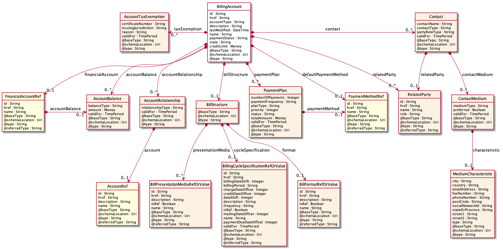
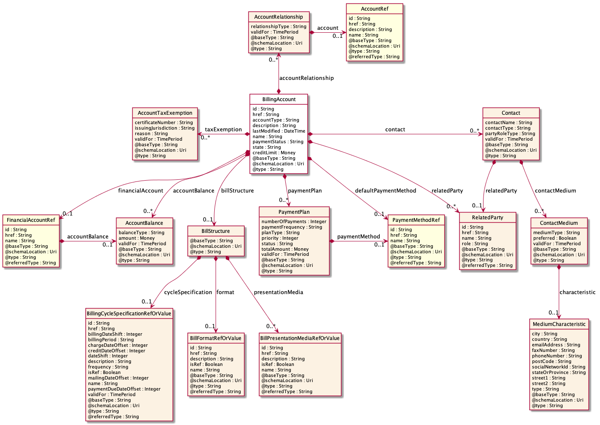
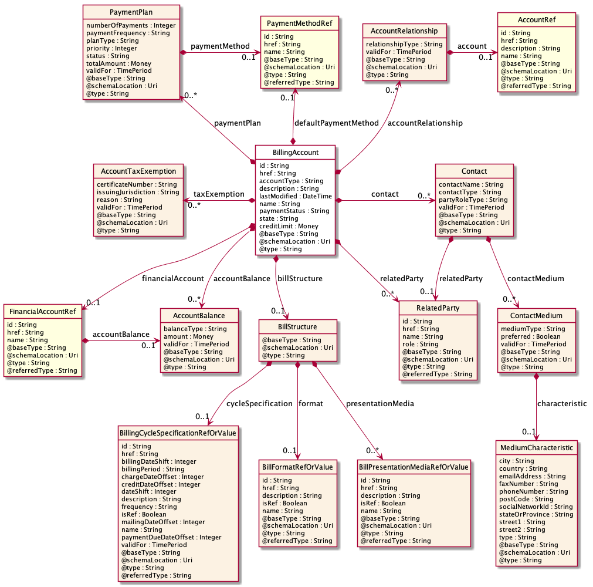
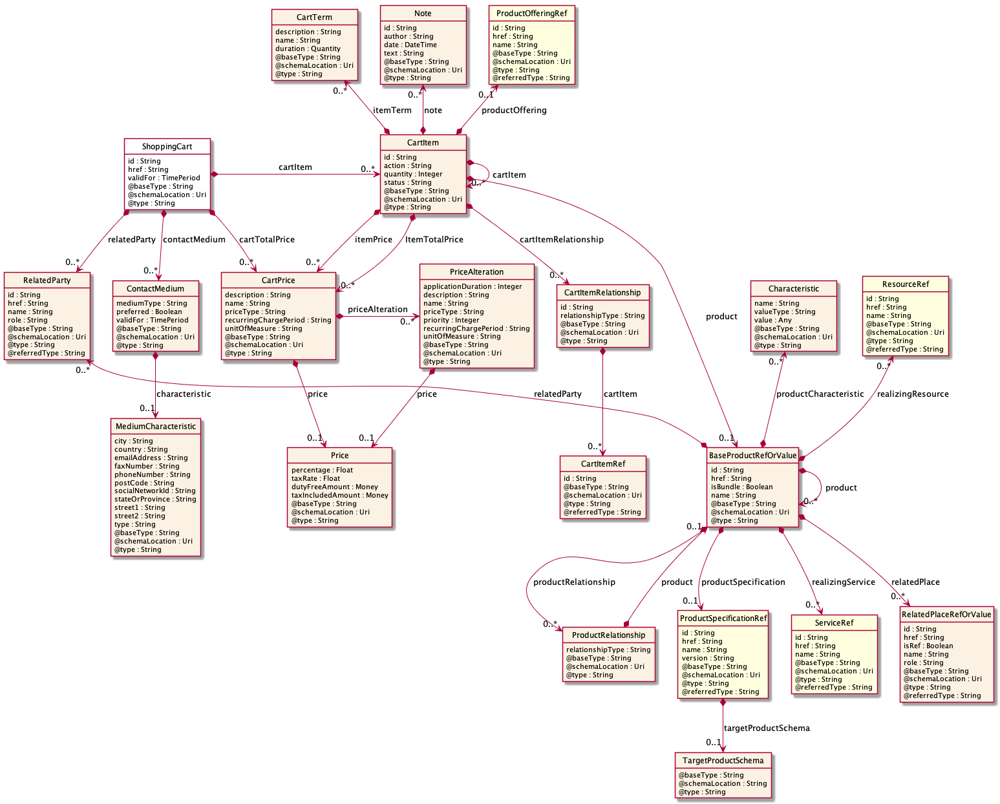
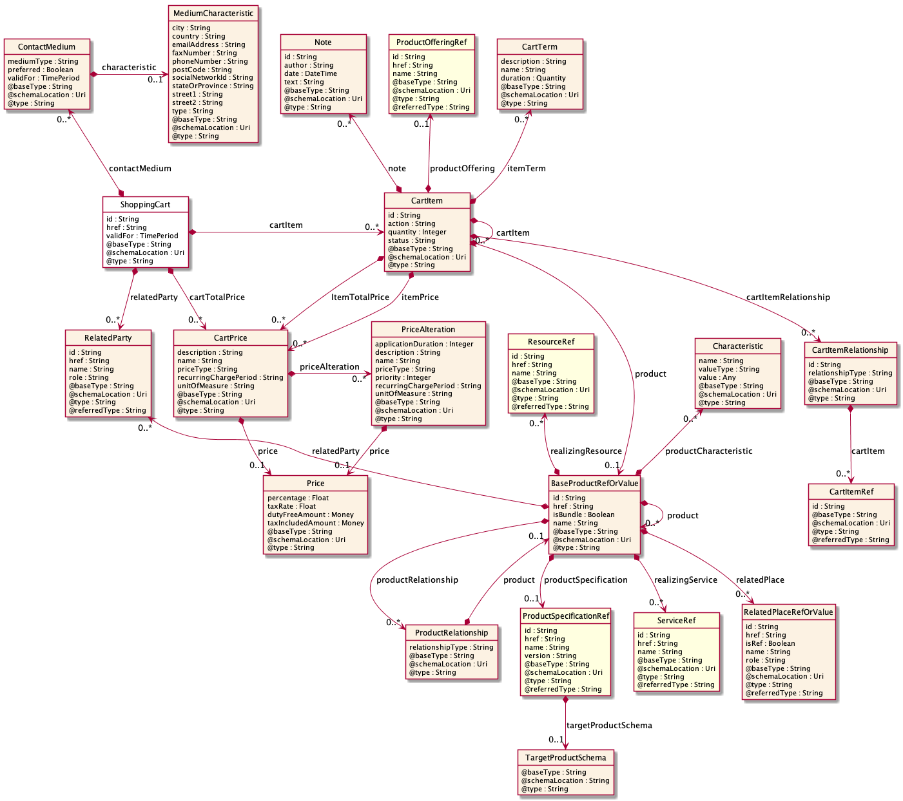
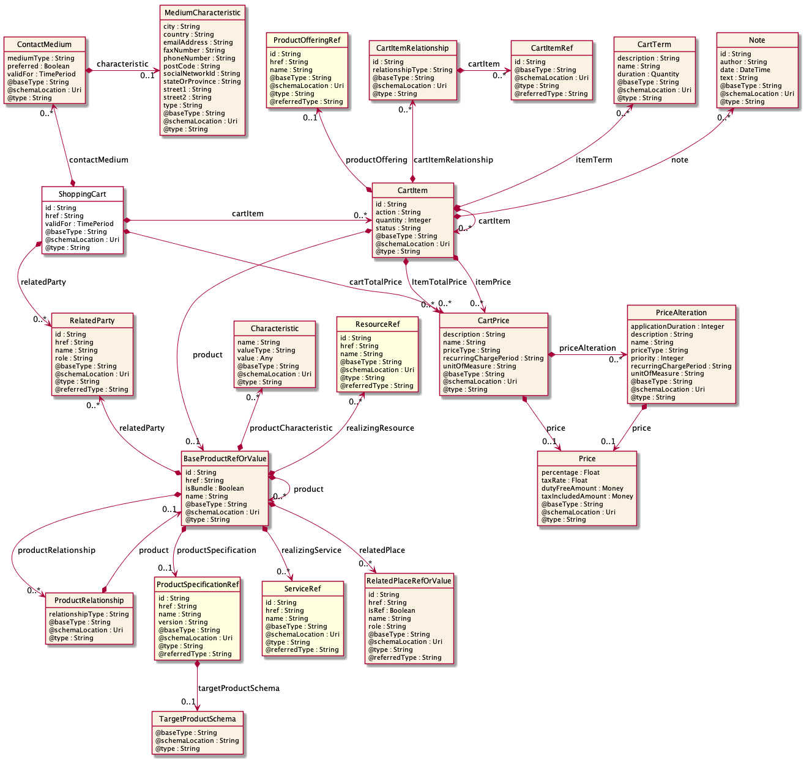
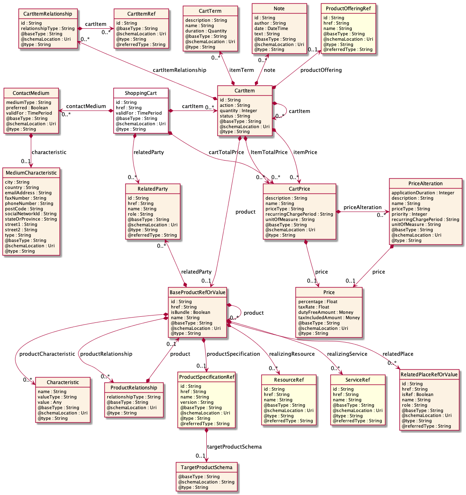

# Instructions for generating swagger diagrams locally

## Pre-requisites

1.	Graphviz must be installed locally

On Windows, follow the instructions found here: https://graphviz.gitlab.io/_pages/Download/Download_windows.html 

On Linux and Mac, follow the instructions found here: https://graphviz.gitlab.io/download/ 


2.	Java must be installed locally

On Windows, Mac and Linux, follow the instructions found here: #TODO


3.	Download the diagram support utility

From most browsers (like Chrome, Firefox, Safari, …)  download from GitHub 

https://github.com/tmforum-rand/diagram-generator/archive/master.zip 

4.	Unpack / unzip the master.zip, accepting the default directory name (“diagram-generator-master”) or select a different destination.

## Running

In the directory with the diagram support utility (see point 4 above), diagrams for APIs are generated by running (on Windows)
```
process_swagger.bat <API file>
```
e.g.
```
process_swagger.bat Service_Problem.regular.swagger.json
```
On Mac/Linux use the `process_swagger.sh` script.

This command will generate one .puml file for each resource in the API and one diagram (.png by default) for each resource (.puml file).

## Manual layout

The automatic layout can in some cases be improved. By default, the layout configuration uses the `layout.json` file in the current directory. 

As an example, if the digram generation is called as follows:
````
$DIR1/process_swagger.sh $DIR2/Shopping_Cart.regular.swagger.json
`````
the `layout.json` is taken from the current directory, not `$DIR1` or `$DIR2`

Use the `-c` option to specify the location of the configuration file, e.g.
```
process_swagger.sh -c layout_cart.json <somedir>/Shopping_Cart.regular.swagger.json
```
### Example 1 - Account
The default BillingAccount layout may look like this



The layout is possibly too wide to print nicely when included in a document. The layout can be guided by the layout configuration settings.
As an example, the following configuration places `AccountRelationship` above the `BillingAccount`

```json
{
   "BillingAccount": {
      "placeAbove": [ "AccountRelationship" ] 
   }

}
```
The diagram now looks like this:


To further balance the layout, we place two more resouces on top:
```json
{
   "BillingAccount": {
	  "placeAbove": [ 
		  "AccountRelationship", 
		  "PaymentPlan", 
		  "PaymentMethodRef" 
		] 
   }

}
```
The final layout is as follows:


### Example 2 - ShoppingCart

The default ShoppingCart layout may look like this



The layout is not too bad, but we would like to improve. One attempt is to place the `ContactMedium` above the `ShoppingCart`. 
```json
{
   "ShoppingCart": {
      "placeAbove":["ContactMedium"],
      "placeRight": ["CartItem"] 
   }
}
```
The automatic layout tries to place `Item` resources to the right of the containing resource, but in this case `CartItem` is not matching. For that reason, we also place the `CartItem` to the right. 

The diagram now looks like this:


To further balance the layout, we place the `CartItemRelationship` also above the `CartItem`:
```json
{
   "ShoppingCart": {
      "placeAbove":["ContactMedium"],
      "placeRight": ["CartItem"] 
   },
   "CartItem": {
      "placeAbove": ["CartItemRelationship"]
   }

}
```
The layout is now like this:


The two nodes above the `BaseProductRefOrValue` seems is creating some "noise" in the diagram. It may be better to also place these below. 
In the configuration file, we now have to specify *four* nodes to place below. If not, the automatic layout will still try to place the other two above. Further, the top row is possibly a bit wide and we move the `ContactMedium` to the left of the `ShoppingCart`. 

The complete configuration file is now like this: 
```json
{
   "ShoppingCart": {
      "placeLeft":["ContactMedium"],
      "placeRight": ["CartItem"] 
   },

   "CartItem": {
      "placeAbove": ["CartItemRelationship"]
   },

   "BaseProductRefOrValue": {
	  "placeBelow": [
		  "Characteristic", 
		  "ResourceRef", 
		  "ServiceRef", 
		  "RelatedPlaceRefOrValue"]
   },

   "ContactMedium": {
      "placeBelow": ["MediumCharacteristic"]
   } 


}
```
The final layout is as follows:

